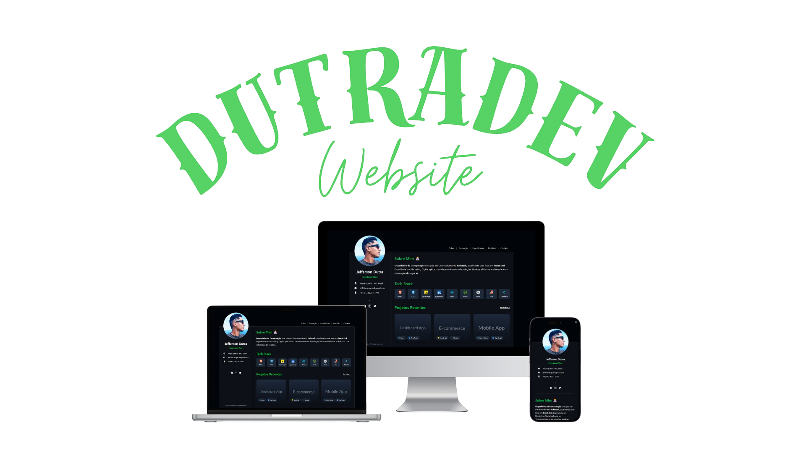

<a name="readme-top"></a>

[](https://nextjs.org/) [](https://github.com/DutraA45/dutradev/blob/main/LICENSE) [](https://github.com/DutraA45/dutradev/blob/main/CONTRIBUTING.md)

[dutradev.vercel.app]: https://dutradev.vercel.app/

<div align="center">
  <a href="https://dutradev.vercel.app/">
    
  </a>
</div>

Bem-vindo ao repositório do meu site pessoal/portfólio! 👋

## ✨ Funcionalidades Principais

- **Stack Moderna** - Desenvolvido com Next.js, TypeScript e Tailwind CSS para alta performance e manutenibilidade
- **SEO Otimizado** - Estrutura semântica e metadados configurados para excelente indexação nos mecanismos de busca
- **Design Profissional** - Interface limpa e direta, focada na experiência do recrutador
- **Performance Excepcional** - Scores elevados no Lighthouse em todos os critérios (performance, acessibilidade, boas práticas)
- **Formulário de Contato Funcional** - Sistema integrado para recebimento de mensagens diretamente no seu email
- **Organização Clara** - Seções bem definidas para apresentação de:
  - Formação acadêmica
  - Experiências profissionais
  - Portfólio de projetos
  - Informações de contato
- **Responsividade** - Layout adaptável para todos os dispositivos (mobile, tablet e desktop)


## 🛠️ Tecnologias Utilizadas

- [Next.js](https://nextjs.org/) - Framework React para produção
- [React](https://reactjs.org/) - Biblioteca para interfaces de usuário
- [TypeScript](https://www.typescriptlang.org/) - JavaScript com tipagem estática
- [Tailwind CSS](https://tailwindcss.com/) - Framework CSS utilitário

## 🛠 Desenvolvimento e Contribuição

Contribuições são bem-vindas! Siga estes passos para configurar o projeto localmente:

### Pré-requisitos
- Node.js (v18 ou superior)
- npm ou yarn
- Conta no GitHub

### Como contribuir

1. Faça um fork do projeto
2. Clone seu fork localmente:
   ```bash
   git clone https://github.com/seu-usuario/seu-portfolio.git
3. Instale as dependências:
    ```bash
    npm install
    # ou
    yarn install
4. Execute o servidor de desenvolvimento:
    ```bash
    npm run dev
    # ou
    yarn dev
5. Abra http://localhost:3000 no seu navegador
6. Crie uma branch para suas alterações:
    ```bash
    git checkout -b minha-contribuicao
7. Faça commit e push das suas alterações
8. Abra um Pull Request no repositório original

## Licença

Este [trabalho] está licenciado sob [Creative Commons Atribuição 4.0 Internacional][cc-by]  por [Dutra](https://dutradev.vercel.app/).

[trabalho]: https://github.com/DutraA45/dutradev
[cc-by]: http://creativecommons.org/licenses/by/4.0/
[dutradev.vercel.app]: https://dutradev.vercel.app/

> [!IMPORTANTE]
>
> 1. Você pode usar este código como inspiração
> 2. Por favor, não copie diretamente
> 3. Atribuir créditos ao autor é apreciado
